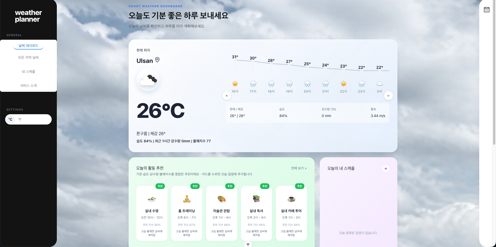
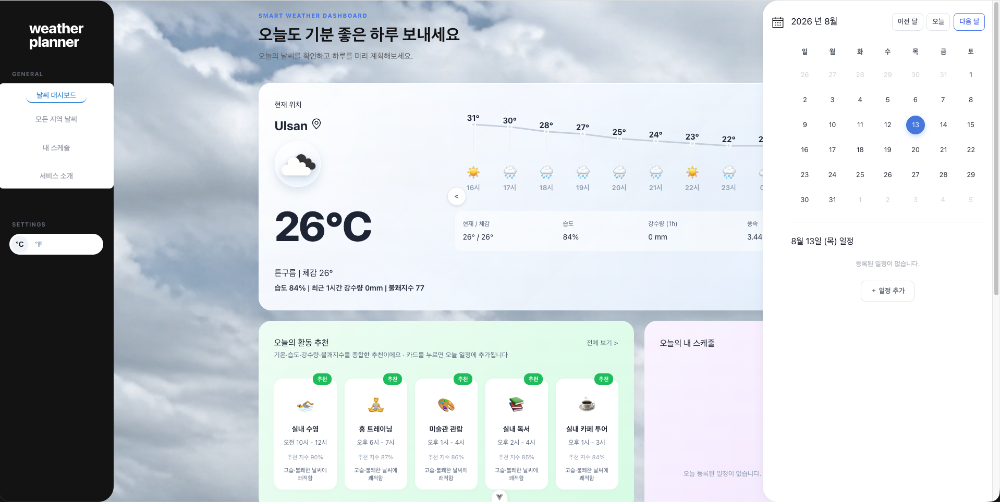
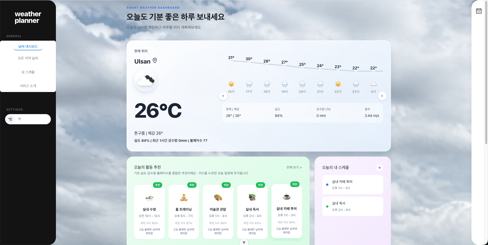
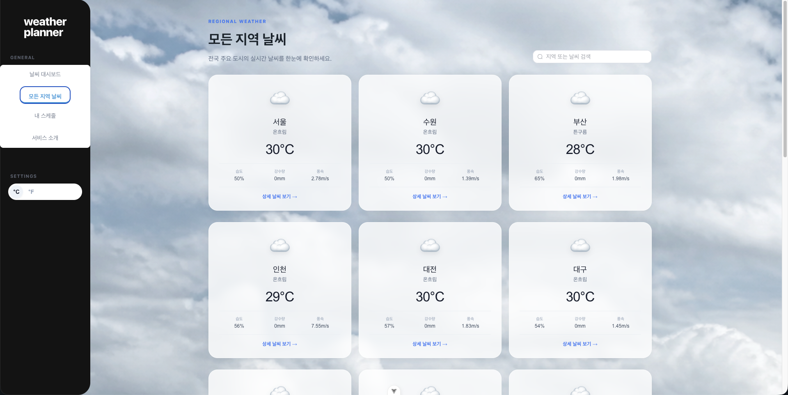
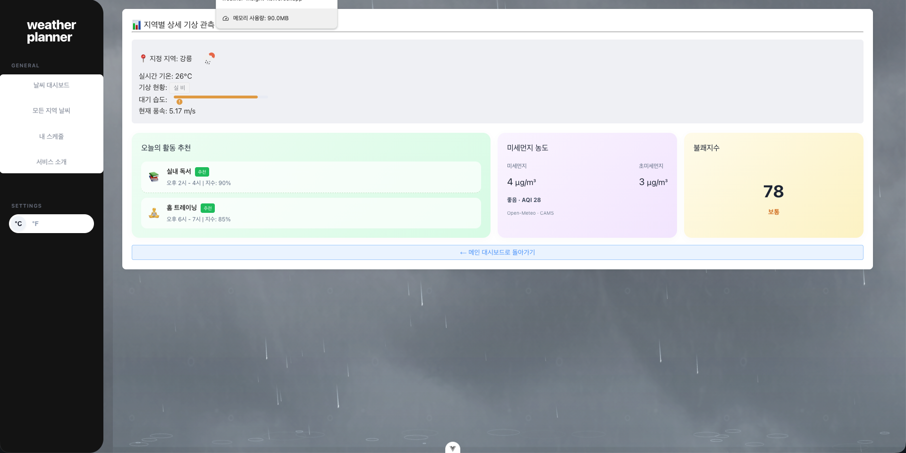
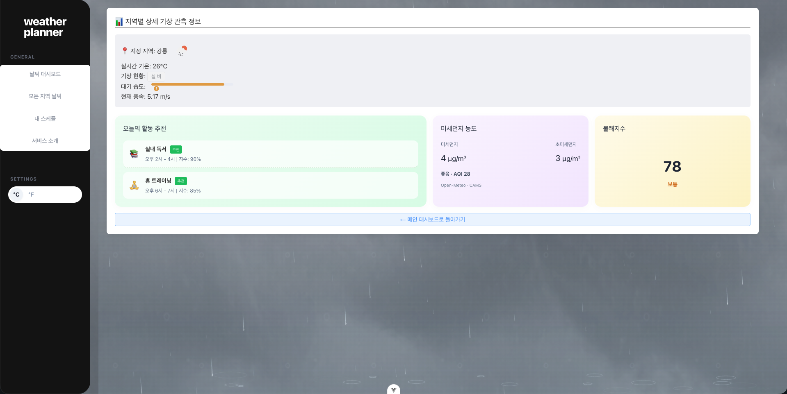
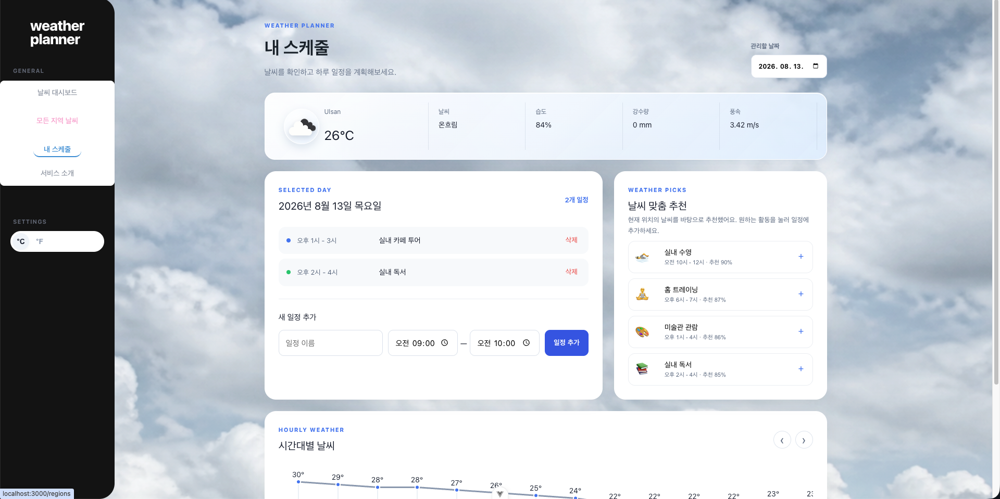
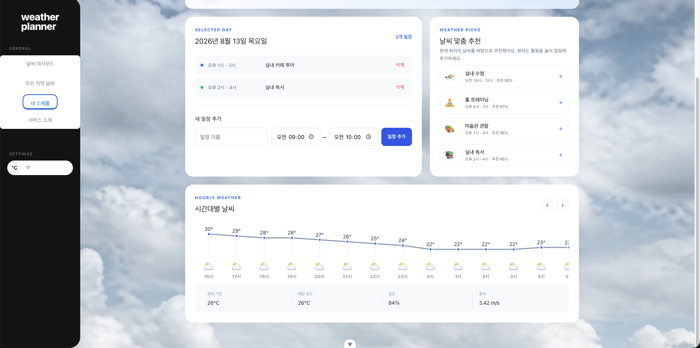
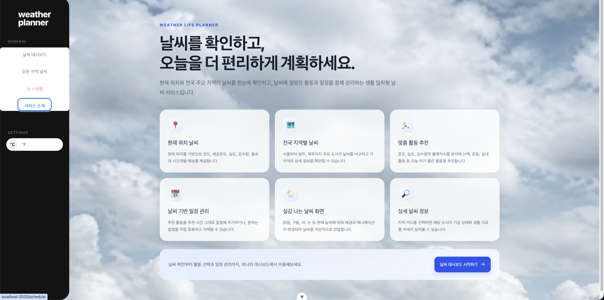

# 🌤️ Weather Planner

Weather Planner는 실시간 날씨 확인부터 활동 추천과 일정 관리까지 한 화면에서 제공하는 날씨 기반 생활 계획 서비스입니다.

사용자의 현재 위치와 전국 주요 도시의 날씨를 보여주고, 온도·습도·강수량·불쾌지수를 분석해 오늘 하기 좋은 활동을 추천합니다. 추천된 활동은 적절한 시간과 함께 오늘 일정에 바로 등록할 수 있으며, 사용자가 원하는 일정을 직접 추가하거나 삭제할 수도 있습니다.

날씨를 숫자로만 보여주는 데 그치지 않고 맑음, 구름, 비, 눈, 뇌우 등의 상태에 따라 움직이는 배경을 적용하여 현재 기상 상황을 직관적으로 느낄 수 있도록 구현했습니다.

## 배포 주소

- Vercel: [Weather Planner 바로가기](https://weather-planner-one.vercel.app/)

## 실행 화면

### 1. 메인 날씨 대시보드



현재 위치의 기온, 체감온도, 습도, 강수량과 시간대별 예보를 표시하고, 날씨 조건을 분석한 맞춤 활동을 추천합니다.

### 2. 달력과 오늘의 일정 레이어



메인 화면 오른쪽에서 대한민국 현재 날짜를 확인하고, 선택한 날짜의 일정을 조회하거나 새로운 일정을 추가할 수 있습니다.

### 3. 추천 활동과 일정 연동



추천 활동 카드를 선택하면 추천 시간이 그대로 오늘 일정에 등록되며, 메인 대시보드의 스케줄 카드에 즉시 반영됩니다.

### 4. 전국 주요 지역 날씨



전국 18개 도시의 날씨, 온도, 습도, 강수량과 풍속을 카드로 비교하고 지역명이나 날씨 상태로 검색할 수 있습니다.

### 5. 지역별 상세 날씨



선택한 지역의 기온, 기상 상태, 습도와 풍속을 확인하고, 해당 날씨에 적합한 활동·대기질·불쾌지수를 함께 제공합니다.

### 6. 비 오는 날씨 애니메이션



비가 오는 지역에서는 실제 날씨 사진 위에 Canvas 기반 빗방울과 바닥 물결 효과를 합성해 현재 기상 상태를 직관적으로 표현합니다.

### 7. 날씨 기반 내 스케줄



관리할 날짜를 선택해 일정을 직접 추가·삭제할 수 있으며, 현재 날씨에 맞는 추천 활동을 버튼 한 번으로 일정에 등록할 수 있습니다.

### 8. 시간대별 날씨와 일정 계획



선택 날짜의 일정과 추천 활동 아래에서 시간대별 기온 변화와 날씨 아이콘을 확인해 하루 계획에 활용할 수 있습니다.

### 9. 서비스 소개



현재 위치 날씨, 전국 지역별 날씨, 맞춤 활동 추천, 일정 관리와 움직이는 날씨 화면 등 서비스의 주요 기능을 안내합니다.

> 실행 화면 이미지는 프로젝트의 `docs/screenshots/` 디렉터리에서 관리합니다.

## 주요 기능

### 1. 현재 위치 실시간 날씨

- 브라우저 위치 정보를 이용한 현재 지역 자동 탐색
- OpenWeatherMap API 기반 실시간 날씨 조회
- 현재 온도, 체감온도, 습도, 강수량, 풍속 표시
- 시간대별 온도 변화와 날씨 아이콘 제공
- 위치 정보 사용이 불가능하면 울산 날씨를 기본값으로 사용

### 2. 전국 주요 지역 날씨

- 서울, 부산, 울산, 청주, 제주 등 전국 18개 도시 지원
- 지역명과 날씨 상태를 이용한 실시간 검색
- 도시별 온도, 습도, 강수량, 풍속 비교
- 카드 호버 시 해당 지역 날씨에 맞는 움직이는 배경 표시
- 카드 선택 시 지역별 상세 날씨 페이지로 이동

### 3. 지역별 상세 날씨

- 선택한 도시의 현재 기온과 기상 상태 제공
- 습도, 풍속, 미세먼지와 대기질 정보 표시
- 해당 지역의 날씨를 기준으로 활동 추천
- 맑음, 구름, 비, 눈, 뇌우에 맞는 움직이는 배경 적용

### 4. 날씨 기반 활동 추천

- 기온, 습도, 강수량과 불쾌지수를 종합해 활동 적합도 계산
- 산책, 러닝, 자전거, 피크닉 등의 야외 활동 추천
- 독서, 홈 트레이닝, 수영, 카페 방문 등의 실내 활동 추천
- 추천 점수, 추천 이유와 적절한 활동 시간 제공
- 추천 활동 선택 시 권장 시간을 오늘 일정에 자동 등록
- 동일한 추천 활동의 중복 등록 방지

### 5. 일정 관리

- 대한민국 시간대를 기준으로 현재 날짜 표시
- 날짜별 일정 추가 및 삭제
- 일정명, 시작 시간과 종료 시간 관리
- 메인 대시보드, 오른쪽 일정 레이어와 내 스케줄 페이지 연동
- 브라우저 저장소를 이용해 새로고침 후에도 일정 유지

### 6. 실시간 대기질

- Open-Meteo Air Quality API 기반 좌표별 대기질 조회
- PM10, PM2.5, 이산화질소(NO₂), 통합 AQI 표시
- 미세먼지 수치에 따른 좋음·보통·나쁨·매우 나쁨 판정
- 메인 대시보드와 지역별 상세 페이지에 실제 데이터 반영
- Open-Meteo와 CAMS 데이터 출처 표시

### 7. 날씨 반응형 배경

- 현재 날씨에 따라 메인 콘텐츠 배경 자동 변경
- 맑은 날의 푸른 하늘과 이동하는 구름 표현
- Canvas 기반 빗방울, 물결과 비구름 효과
- 눈이 내리는 설경과 뇌우 상태의 번개 효과
- 데스크톱과 모바일 화면을 위한 반응형 레이아웃

### 8. 화면 이동과 사이드바

- 스크롤해도 유지되는 고정형 왼쪽 사이드바
- 날씨 대시보드, 모든 지역 날씨, 내 스케줄, 서비스 소개 메뉴 제공
- Vue Router 기반 새로고침 없는 화면 전환
- 다른 페이지로 이동하면 스크롤 위치를 최상단으로 초기화

### 9. 온도 단위 설정

- 사이드바 버튼으로 섭씨와 화씨 전환
- 메인 대시보드, 모든 지역 날씨와 상세 페이지에 설정 동기화
- Pinia의 `configStore`를 이용한 공통 단위 상태 관리

## 강의에서 배운 내용을 활용한 구현

### 1. Vue Directive를 활용한 동적 화면 구성

- `v-for`와 `:key`를 사용해 전국 지역 날씨 카드, 시간대별 예보, 추천 활동과 일정 목록을 반복 렌더링했습니다.
- `v-if`, `v-else-if`, `v-else`를 활용해 데이터 로딩 여부, 일정 유무, 검색 결과와 날씨 상태에 따라 필요한 화면만 표시했습니다.
- `v-model`을 사용해 지역 검색어, 일정 입력 폼, 날짜 선택과 다이얼로그 상태를 화면 데이터와 양방향으로 연결했습니다.
- `:class`와 `:style`을 이용해 날씨 상태별 배경, 추천 상태, 일정 색상과 불쾌지수 진행률을 동적으로 변경했습니다.
- `@click`, `@keydown`과 `.stop`, `.prevent` 이벤트 수식어를 활용해 카드 선택, 일정 추가, 레이어 닫기와 키보드 접근성을 구현했습니다.

### 2. Composition API를 활용한 반응형 데이터 처리

- `ref`로 검색어, 선택 날짜, 일정 입력값, 스크롤 대상과 레이어 열림 상태를 반응형으로 관리했습니다.
- `computed`를 사용해 검색된 도시 목록, 날짜별 일정, 온도 단위 변환, 불쾌지수와 날씨별 추천 결과를 자동 계산했습니다.
- `onMounted`에서 화면 진입 시 날씨와 대기질 데이터를 불러오도록 구성했습니다.
- 화면 상태가 변경되면 관련 UI가 자동으로 갱신되도록 Vue의 반응형 데이터 흐름을 적용했습니다.

### 3. Component를 활용한 UI 역할 분리

- 온도 단위 전환 기능을 `UnitToggler.vue`로 분리해 사이드바에서 재사용할 수 있도록 구현했습니다.
- 비 효과를 `RainEffect.vue`로 분리하고 `storm` prop을 전달해 일반 비와 뇌우 효과를 구분했습니다.
- 공통 기능을 컴포넌트 단위로 나누어 화면 코드와 효과 코드를 독립적으로 관리했습니다.

### 4. Pinia Store를 활용한 전역 상태 관리

- `weatherStore`에서 전국 도시 목록, 현재 위치 날씨, 지역별 날씨와 대기질 API 요청을 관리했습니다.
- `configStore`에서 섭씨·화씨 단위와 단위 변경 action을 관리해 여러 페이지에서 동일한 설정을 사용했습니다.
- `recommendationStore`에서 기온, 습도, 강수량과 불쾌지수를 분석해 활동 점수와 추천 이유를 생성했습니다.
- `scheduleStore`에서 날짜별 일정의 추가·삭제·조회와 브라우저 저장소 동기화를 담당하도록 구현했습니다.
- 이를 통해 메인 화면, 일정 페이지와 상세 페이지가 동일한 상태를 공유하도록 구성했습니다.

### 5. Vue Router를 활용한 SPA 화면 이동

- 메인 대시보드, 모든 지역 날씨, 지역 상세 날씨, 내 스케줄과 서비스 소개 화면을 각각의 Route로 구성했습니다.
- `RouterLink`와 `router.push()`를 이용해 페이지 새로고침 없이 화면을 전환했습니다.
- `/weather/:cityId` 동적 파라미터를 사용해 하나의 상세 View에서 선택한 도시의 데이터를 표시했습니다.
- `scrollBehavior`를 적용해 다른 페이지로 이동할 때 화면이 항상 최상단에서 시작하도록 구현했습니다.
- 정의되지 않은 주소에는 Not Found 화면이 표시되도록 예외 Route를 구성했습니다.

### 6. Axios와 외부 API를 활용한 실시간 데이터 서비스

- Axios의 `get` 요청과 `async/await`를 이용해 OpenWeatherMap에서 실제 날씨 데이터를 가져왔습니다.
- 브라우저 Geolocation API로 얻은 위도와 경도를 요청에 전달해 현재 위치 날씨를 조회했습니다.
- `Promise.all()`을 사용해 전국 18개 도시의 날씨와 대기질 요청을 병렬로 처리했습니다.
- OpenWeatherMap 응답의 도시 좌표를 Open-Meteo Air Quality API와 연결해 PM10, PM2.5, NO₂와 AQI를 제공했습니다.
- `try-catch-finally`로 API 오류와 로딩 상태를 처리하고, 위치 조회가 실패하면 울산 날씨를 사용하는 대체 흐름을 구현했습니다.

### 7. Element Plus를 활용한 사용자 인터페이스

- `el-calendar`를 활용해 대한민국 현재 날짜와 날짜별 일정이 표시되는 달력을 구현했습니다.
- `el-dialog`와 입력 요소를 이용해 일정 추가 폼을 제공했습니다.
- `el-input`에 검색어를 연결해 지역 날씨를 실시간으로 검색할 수 있도록 구성했습니다.
- `el-button`, `el-icon`, `el-tag`, `el-progress`, `el-empty`로 버튼, 날씨 상태, 습도 진행률과 빈 데이터 안내를 표현했습니다.
- `ElMessage`를 사용해 일정 추가, 중복 등록과 입력 오류 결과를 사용자에게 즉시 안내했습니다.

### 8. Modern JavaScript를 활용한 데이터 가공

- 구조 분해 할당으로 위치 좌표와 API 응답의 필요한 데이터를 간결하게 추출했습니다.
- 스프레드 연산자를 사용해 기존 상태를 직접 변경하지 않고 새로운 일정과 날씨 객체를 생성했습니다.
- 옵셔널 체이닝(`?.`)과 Null 병합 연산자(`??`)를 사용해 API 데이터가 없는 경우에도 화면 오류가 발생하지 않도록 처리했습니다.
- 템플릿 리터럴을 활용해 API URL, 시간 범위와 사용자 안내 문구를 동적으로 생성했습니다.
- 배열의 `map`, `filter`, `some`, `sort`를 활용해 검색, 중복 검사, 추천 계산과 일정 정렬을 구현했습니다.

### 9. CSS와 Canvas를 활용한 날씨 시각 효과

- 동적 클래스와 CSS 애니메이션을 결합해 맑음, 구름, 비, 눈과 뇌우 상태별 배경을 구현했습니다.
- `transform`과 `translate3d`를 사용해 배경 이미지가 끊기거나 버벅이지 않고 천천히 이동하도록 구성했습니다.
- Canvas와 `requestAnimationFrame`을 활용해 길이, 속도, 투명도와 위치가 서로 다른 빗방울을 실시간으로 그렸습니다.
- 빗방울 충돌 지점에 물결 효과를 추가하고 뇌우 상태에서는 강수 밀도와 속도를 높였습니다.
- 미디어 쿼리를 사용해 데스크톱과 모바일 환경에 맞는 반응형 레이아웃을 구현했습니다.

### 10. Vite와 코드 품질 관리 도구를 활용한 배포 준비

- Vite 환경변수인 `import.meta.env.VITE_OPENWEATHER_API_KEY`를 사용해 API 키를 소스 코드에서 분리했습니다.
- `.env` 파일을 Git 제외 대상으로 설정하고 `.env.example`을 통해 필요한 환경변수 형식만 제공합니다.
- ESLint와 Oxlint로 문법 오류, 사용하지 않는 변수와 잠재적인 문제를 검사합니다.
- Prettier를 사용해 Vue, JavaScript와 CSS 코드의 형식을 일관되게 관리합니다.
- `npm run build`로 브라우저가 실행할 수 있는 정적 배포 파일을 `dist` 폴더에 생성하도록 구성했습니다.

## 화면 구성

기본 경로인 `/`는 현재 위치의 날씨, 시간대별 예보, 추천 활동, 오늘의 일정, 미세먼지와 불쾌지수를 보여주는 메인 대시보드입니다.

`/regions`에서는 전국 주요 도시의 날씨를 검색하고 비교할 수 있습니다. 지역을 선택하면 `/weather/:cityId` 형식의 상세 페이지로 이동합니다.

`/schedule`은 날씨 정보와 추천 활동을 함께 제공하는 일정 관리 페이지입니다. `/about`에서는 Weather Planner가 제공하는 서비스를 간단하게 소개합니다.

## 기술 구성

프론트엔드는 Vue 3와 Composition API로 구현했으며 개발 서버와 프로덕션 빌드에는 Vite를 사용합니다. 공통 상태는 Pinia로 관리하고 화면 이동은 Vue Router로 처리합니다.

달력, 입력 폼, 다이얼로그, 버튼, 로딩 화면과 알림 메시지에는 Element Plus를 활용했습니다. 외부 API 통신은 Axios를 사용합니다. 날씨 데이터는 OpenWeatherMap API에서 가져오며 대기질 데이터는 Open-Meteo Air Quality API에서 가져옵니다.

소스 코드의 오류와 규칙 위반은 ESLint와 Oxlint로 검사하고, Prettier를 이용해 코드 형식을 관리합니다.

## 주요 상태 관리

`weatherStore`는 전국 도시 목록, 현재 위치 날씨, 지역별 날씨와 대기질 API 통신을 담당합니다.

`configStore`는 섭씨·화씨 단위와 단위 변경 동작을 관리합니다.

`recommendationStore`는 날씨 조건을 분석해 활동 점수와 추천 이유를 생성합니다.

`scheduleStore`는 날짜별 일정의 추가·삭제·조회와 브라우저 저장소 동기화를 담당합니다.

## 프로젝트 실행 방법

먼저 프로젝트 의존성을 설치합니다.

```bash
npm install
```

프로젝트 루트의 `.env.example`을 복사해 `.env.local` 파일을 만들고, OpenWeatherMap에서 발급받은 API 키를 입력합니다.

```env
VITE_OPENWEATHER_API_KEY=your_openweather_api_key
```

실제 API 키가 들어 있는 `.env`와 `.env.local` 파일은 Git에 포함되지 않습니다.

개발 서버는 다음 명령으로 실행합니다.

```bash
npm run dev
```

터미널에 표시되는 로컬 주소로 접속하면 Weather Planner를 확인할 수 있습니다. 현재 위치 날씨를 사용하려면 브라우저의 위치 정보 권한을 허용해야 합니다.

## 코드 품질 검사

ESLint와 Oxlint를 한 번에 실행하려면 다음 명령을 사용합니다.

```bash
npm run check
```

기존 Vite 과제 설정 방식으로 자동 수정을 포함한 검사를 실행하려면 다음 명령도 사용할 수 있습니다.

```bash
npm run lint
```

코드 형식을 정리하려면 다음 명령을 사용합니다.

```bash
npm run format
```

## 프로덕션 빌드

배포용 정적 파일은 다음 명령으로 생성합니다.

```bash
npm run build
```

빌드가 완료되면 프로젝트 루트에 `dist` 폴더가 생성됩니다. 이 폴더에는 브라우저가 실행할 수 있는 HTML, JavaScript, CSS와 이미지 파일이 포함됩니다.

빌드 결과를 로컬에서 확인하려면 다음 명령을 사용합니다.

```bash
npm run preview
```

최종 배포 시에는 `dist` 폴더를 AWS S3, Nginx, Netlify, Vercel 등의 정적 웹 호스팅 서버에 업로드하고 메인 페이지와 각 라우팅 경로가 정상적으로 작동하는지 확인합니다.

## API 및 데이터 출처

날씨 데이터와 날씨 아이콘은 OpenWeatherMap API를 사용합니다.

대기질 데이터는 Open-Meteo Air Quality API와 Copernicus Atmosphere Monitoring Service(CAMS) 자료를 사용합니다.

## 제출 전 확인사항

- `npm install` 이후 `npm run dev`로 정상 실행되는지 확인
- `.env.example`을 참고해 `VITE_OPENWEATHER_API_KEY`를 설정했는지 확인
- `npm run check` 결과가 0 warnings, 0 errors인지 확인
- `npm run build`가 정상적으로 완료되는지 확인
- README에 실행 화면 이미지가 정상적으로 표시되는지 확인
- README에 실제 Vercel 배포 주소가 작성되어 있는지 확인
- Vercel의 메인 페이지와 하위 Route 새로고침이 정상 동작하는지 확인
- 제출 ZIP에서 `node_modules`, `dist`, `.git`, `.env.local`을 제외했는지 확인
- 제출 파일명을 `울산4반_Vue_4일차_종합실습제출_한유진.zip`으로 작성했는지 확인
